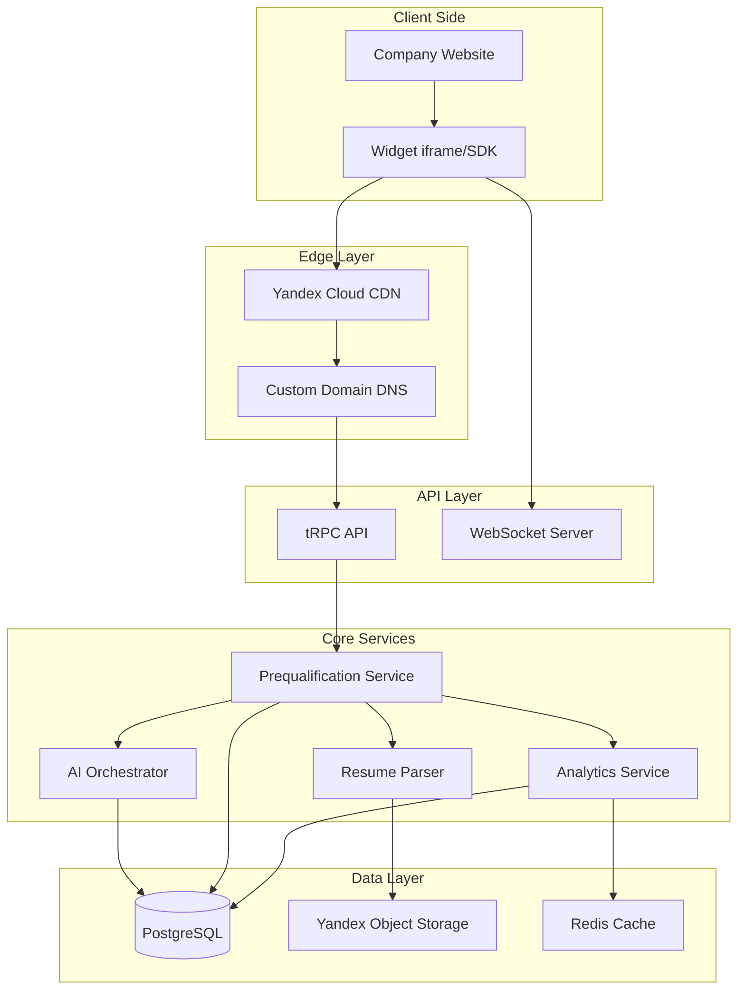
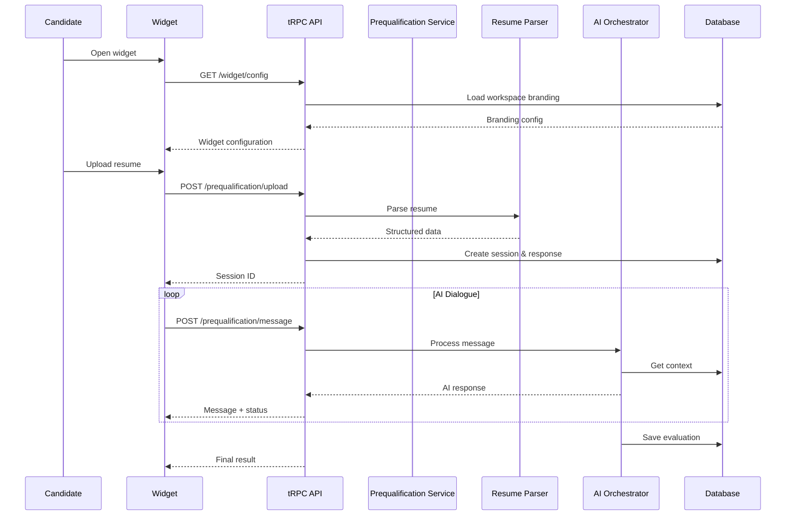

# Design Document: Candidate Prequalification System

## Overview

Система преквалификации кандидатов расширяет существующую архитектуру платформы, добавляя white-label виджет для встраивания на карьерные страницы компаний. Система использует существующую multi-tenant архитектуру (Organization → Workspace) и интегрируется с текущими AI-агентами для проведения диалогов и оценки кандидатов.

Ключевые архитектурные решения:
- Использование существующей иерархии Organization → Workspace как основы для tenant-изоляции
- Расширение существующих таблиц `vacancy`, `vacancyResponse`, `conversation` для поддержки web-виджета
- Создание нового пакета `@qbs-autonaim/widget` для встраиваемого компонента
- Интеграция с существующими AI-агентами через `InterviewOrchestrator`

## Architecture



### Request Flow



## Components and Interfaces

### 1. Widget Package (`@qbs-autonaim/widget`)

Встраиваемый React-компонент для карьерных страниц компаний.

```typescript
// packages/widget/src/types.ts
interface WidgetConfig {
  workspaceId: string;
  vacancyId?: string; // Optional: specific vacancy
  theme: WidgetTheme;
  locale: 'ru' | 'en';
  onComplete?: (result: PrequalificationResult) => void;
}

interface WidgetTheme {
  primaryColor: string;
  backgroundColor: string;
  textColor: string;
  fontFamily: string;
  borderRadius: number;
  logo?: string;
  assistantName: string;
  assistantAvatar?: string;
}

interface PrequalificationResult {
  sessionId: string;
  fitDecision: 'strong_fit' | 'potential_fit' | 'not_fit';
  fitScore: number;
  feedback: string;
  canProceed: boolean;
}
```

### 2. Prequalification Service

Основной сервис для управления сессиями преквалификации.

```typescript
// packages/api/src/services/prequalification.ts
interface PrequalificationService {
  // Session management
  createSession(input: CreateSessionInput): Promise<PrequalificationSession>;
  getSession(sessionId: string): Promise<PrequalificationSession | null>;
  
  // Resume handling
  uploadResume(sessionId: string, file: File): Promise<ParsedResume>;
  
  // Dialogue
  processMessage(sessionId: string, message: string): Promise<AIResponse>;
  
  // Evaluation
  evaluateCandidate(sessionId: string): Promise<EvaluationResult>;
  
  // Completion
  submitApplication(sessionId: string): Promise<void>;
}

interface CreateSessionInput {
  workspaceId: string;
  vacancyId: string;
  candidateConsent: boolean;
  source: 'widget' | 'direct';
}

interface PrequalificationSession {
  id: string;
  workspaceId: string;
  vacancyId: string;
  responseId: string;
  conversationId: string;
  status: SessionStatus;
  parsedResume?: ParsedResume;
  evaluation?: EvaluationResult;
  createdAt: Date;
  updatedAt: Date;
}

type SessionStatus = 
  | 'consent_pending'
  | 'resume_pending'
  | 'dialogue_active'
  | 'evaluating'
  | 'completed'
  | 'submitted'
  | 'expired';
```

### 3. Resume Parser Service

Сервис для парсинга резюме из различных форматов.

```typescript
// packages/api/src/services/resume-parser.ts
interface ResumeParserService {
  parse(input: ResumeInput): Promise<ParsedResume>;
  validateFormat(file: File): ValidationResult;
}

interface ResumeInput {
  type: 'pdf' | 'docx' | 'linkedin_url';
  content: Buffer | string;
}

interface ParsedResume {
  rawText: string;
  structured: StructuredResume;
  confidence: number;
}

interface StructuredResume {
  personalInfo: {
    name?: string;
    email?: string;
    phone?: string;
    location?: string;
  };
  experience: WorkExperience[];
  education: Education[];
  skills: string[];
  languages: Language[];
  summary?: string;
}

interface WorkExperience {
  company: string;
  position: string;
  startDate?: string;
  endDate?: string;
  description?: string;
  isCurrent: boolean;
}
```

### 4. Evaluation Service

Сервис для оценки соответствия кандидата вакансии.

```typescript
// packages/api/src/services/evaluation.ts
interface EvaluationService {
  evaluate(input: EvaluationInput): Promise<EvaluationResult>;
  generateFeedback(result: EvaluationResult, config: FeedbackConfig): string;
}

interface EvaluationInput {
  parsedResume: ParsedResume;
  dialogueHistory: Message[];
  vacancy: Vacancy;
  workspaceConfig: WorkspacePrequalificationConfig;
}

interface EvaluationResult {
  fitScore: number; // 0-100
  fitDecision: 'strong_fit' | 'potential_fit' | 'not_fit';
  dimensions: {
    hardSkills: DimensionScore;
    softSkills: DimensionScore;
    cultureFit: DimensionScore;
    salaryAlignment: DimensionScore;
  };
  strengths: string[];
  risks: string[];
  recommendation: string;
  aiSummary: string;
}

interface DimensionScore {
  score: number; // 0-100
  confidence: number; // 0-1
  notes: string;
}
```

### 5. Widget Configuration Service

Сервис для управления настройками виджета.

```typescript
// packages/api/src/services/widget-config.ts
interface WidgetConfigService {
  getConfig(workspaceId: string): Promise<WidgetConfiguration>;
  updateConfig(workspaceId: string, config: Partial<WidgetConfiguration>): Promise<void>;
  validateCustomDomain(domain: string): Promise<DomainValidationResult>;
  provisionSSL(domain: string): Promise<SSLProvisionResult>;
}

interface WidgetConfiguration {
  workspaceId: string;
  branding: BrandingConfig;
  behavior: BehaviorConfig;
  legal: LegalConfig;
  customDomain?: CustomDomainConfig;
}

interface BrandingConfig {
  logo?: string;
  primaryColor: string;
  secondaryColor: string;
  backgroundColor: string;
  textColor: string;
  fontFamily: string;
  assistantName: string;
  assistantAvatar?: string;
  welcomeMessage: string;
  completionMessage: string;
}

interface BehaviorConfig {
  passThreshold: number; // 0-100
  mandatoryQuestions: string[];
  tone: 'formal' | 'friendly';
  honestyLevel: 'direct' | 'diplomatic' | 'encouraging';
  maxDialogueTurns: number;
  sessionTimeoutMinutes: number;
}

interface LegalConfig {
  consentText: string;
  disclaimerText: string;
  privacyPolicyUrl: string;
  dataRetentionDays: number;
}

interface CustomDomainConfig {
  domain: string;
  cnameTarget: string;
  verified: boolean;
  sslStatus: 'pending' | 'active' | 'expired' | 'error';
  sslExpiresAt?: Date;
}
```

### 6. Analytics Service

Сервис для сбора и агрегации аналитики.

```typescript
// packages/api/src/services/analytics.ts
interface AnalyticsService {
  trackEvent(event: AnalyticsEvent): Promise<void>;
  getDashboard(workspaceId: string, period: DateRange): Promise<DashboardData>;
  getVacancyAnalytics(vacancyId: string, period: DateRange): Promise<VacancyAnalytics>;
  exportData(workspaceId: string, format: 'csv' | 'json'): Promise<Buffer>;
}

interface AnalyticsEvent {
  workspaceId: string;
  vacancyId?: string;
  sessionId?: string;
  eventType: EventType;
  metadata?: Record<string, unknown>;
  timestamp: Date;
}

type EventType = 
  | 'widget_view'
  | 'session_start'
  | 'resume_upload'
  | 'dialogue_message'
  | 'dialogue_complete'
  | 'evaluation_complete'
  | 'application_submit';

interface DashboardData {
  totalCandidates: number;
  passRate: number;
  averageFitScore: number;
  conversionRate: number;
  funnel: FunnelMetrics;
  trends: TrendData[];
  topVacancies: VacancySummary[];
}

interface FunnelMetrics {
  widgetViews: number;
  sessionsStarted: number;
  resumesUploaded: number;
  dialoguesCompleted: number;
  candidatesPassed: number;
  applicationsSubmitted: number;
}
```

## Data Models

### New Tables

```typescript
// packages/db/src/schema/prequalification/session.ts
export const prequalificationSession = pgTable(
  "prequalification_sessions",
  {
    id: uuid("id").primaryKey().default(sql`uuid_generate_v7()`),
    workspaceId: text("workspace_id")
      .notNull()
      .references(() => workspace.id, { onDelete: "cascade" }),
    vacancyId: uuid("vacancy_id")
      .notNull()
      .references(() => vacancy.id, { onDelete: "cascade" }),
    responseId: uuid("response_id")
      .references(() => vacancyResponse.id, { onDelete: "set null" }),
    conversationId: uuid("conversation_id")
      .references(() => conversation.id, { onDelete: "set null" }),
    
    status: pgEnum("prequalification_status", [
      "consent_pending",
      "resume_pending", 
      "dialogue_active",
      "evaluating",
      "completed",
      "submitted",
      "expired"
    ])("status").default("consent_pending").notNull(),
    
    source: pgEnum("prequalification_source", ["widget", "direct"])("source")
      .default("widget").notNull(),
    
    // Parsed resume data
    parsedResume: jsonb("parsed_resume").$type<ParsedResume>(),
    
    // Evaluation results
    fitScore: integer("fit_score"),
    fitDecision: pgEnum("fit_decision", [
      "strong_fit", "potential_fit", "not_fit"
    ])("fit_decision"),
    evaluation: jsonb("evaluation").$type<EvaluationResult>(),
    
    // Candidate feedback
    candidateFeedback: text("candidate_feedback"),
    
    // Consent tracking
    consentGivenAt: timestamp("consent_given_at", { withTimezone: true }),
    
    // Session metadata
    userAgent: text("user_agent"),
    ipAddress: varchar("ip_address", { length: 45 }),
    
    expiresAt: timestamp("expires_at", { withTimezone: true }),
    createdAt: timestamp("created_at", { withTimezone: true })
      .defaultNow().notNull(),
    updatedAt: timestamp("updated_at", { withTimezone: true })
      .defaultNow().$onUpdate(() => new Date()).notNull(),
  },
  (table) => ({
    workspaceIdx: index("preq_session_workspace_idx").on(table.workspaceId),
    vacancyIdx: index("preq_session_vacancy_idx").on(table.vacancyId),
    statusIdx: index("preq_session_status_idx").on(table.status),
    fitScoreIdx: index("preq_session_fit_score_idx").on(table.fitScore),
  })
);
```

```typescript
// packages/db/src/schema/prequalification/widget-config.ts
export const widgetConfig = pgTable(
  "widget_configs",
  {
    id: uuid("id").primaryKey().default(sql`uuid_generate_v7()`),
    workspaceId: text("workspace_id")
      .notNull()
      .unique()
      .references(() => workspace.id, { onDelete: "cascade" }),
    
    // Branding
    logo: text("logo"),
    primaryColor: varchar("primary_color", { length: 7 }).default("#3B82F6"),
    secondaryColor: varchar("secondary_color", { length: 7 }).default("#1E40AF"),
    backgroundColor: varchar("background_color", { length: 7 }).default("#FFFFFF"),
    textColor: varchar("text_color", { length: 7 }).default("#1F2937"),
    fontFamily: varchar("font_family", { length: 100 }).default("Inter"),
    assistantName: varchar("assistant_name", { length: 100 }).default("AI Assistant"),
    assistantAvatar: text("assistant_avatar"),
    welcomeMessage: text("welcome_message"),
    completionMessage: text("completion_message"),
    
    // Behavior
    passThreshold: integer("pass_threshold").default(60),
    mandatoryQuestions: jsonb("mandatory_questions").$type<string[]>().default([]),
    tone: pgEnum("widget_tone", ["formal", "friendly"])("tone").default("friendly"),
    honestyLevel: pgEnum("honesty_level", ["direct", "diplomatic", "encouraging"])
      ("honesty_level").default("diplomatic"),
    maxDialogueTurns: integer("max_dialogue_turns").default(10),
    sessionTimeoutMinutes: integer("session_timeout_minutes").default(30),
    
    // Legal
    consentText: text("consent_text"),
    disclaimerText: text("disclaimer_text"),
    privacyPolicyUrl: text("privacy_policy_url"),
    dataRetentionDays: integer("data_retention_days").default(90),
    
    createdAt: timestamp("created_at", { withTimezone: true })
      .defaultNow().notNull(),
    updatedAt: timestamp("updated_at", { withTimezone: true })
      .defaultNow().$onUpdate(() => new Date()).notNull(),
  }
);
```

```typescript
// packages/db/src/schema/prequalification/custom-domain.ts
export const customDomain = pgTable(
  "custom_domains",
  {
    id: uuid("id").primaryKey().default(sql`uuid_generate_v7()`),
    workspaceId: text("workspace_id")
      .notNull()
      .references(() => workspace.id, { onDelete: "cascade" }),
    
    domain: varchar("domain", { length: 255 }).notNull().unique(),
    cnameTarget: varchar("cname_target", { length: 255 }).notNull(),
    
    verified: boolean("verified").default(false),
    verifiedAt: timestamp("verified_at", { withTimezone: true }),
    lastVerificationAttempt: timestamp("last_verification_attempt", { withTimezone: true }),
    verificationError: text("verification_error"),
    
    sslStatus: pgEnum("ssl_status", ["pending", "active", "expired", "error"])
      ("ssl_status").default("pending"),
    sslCertificateId: varchar("ssl_certificate_id", { length: 255 }),
    sslExpiresAt: timestamp("ssl_expires_at", { withTimezone: true }),
    
    createdAt: timestamp("created_at", { withTimezone: true })
      .defaultNow().notNull(),
    updatedAt: timestamp("updated_at", { withTimezone: true })
      .defaultNow().$onUpdate(() => new Date()).notNull(),
  },
  (table) => ({
    workspaceIdx: index("custom_domain_workspace_idx").on(table.workspaceId),
    domainIdx: index("custom_domain_domain_idx").on(table.domain),
  })
);
```

```typescript
// packages/db/src/schema/prequalification/analytics-event.ts
export const analyticsEvent = pgTable(
  "analytics_events",
  {
    id: uuid("id").primaryKey().default(sql`uuid_generate_v7()`),
    workspaceId: text("workspace_id")
      .notNull()
      .references(() => workspace.id, { onDelete: "cascade" }),
    vacancyId: uuid("vacancy_id")
      .references(() => vacancy.id, { onDelete: "set null" }),
    sessionId: uuid("session_id")
      .references(() => prequalificationSession.id, { onDelete: "set null" }),
    
    eventType: pgEnum("analytics_event_type", [
      "widget_view",
      "session_start",
      "resume_upload",
      "dialogue_message",
      "dialogue_complete",
      "evaluation_complete",
      "application_submit"
    ])("event_type").notNull(),
    
    metadata: jsonb("metadata").$type<Record<string, unknown>>(),
    
    timestamp: timestamp("timestamp", { withTimezone: true })
      .defaultNow().notNull(),
  },
  (table) => ({
    workspaceIdx: index("analytics_workspace_idx").on(table.workspaceId),
    vacancyIdx: index("analytics_vacancy_idx").on(table.vacancyId),
    eventTypeIdx: index("analytics_event_type_idx").on(table.eventType),
    timestampIdx: index("analytics_timestamp_idx").on(table.timestamp),
    // Composite index for dashboard queries
    workspaceTimestampIdx: index("analytics_workspace_timestamp_idx")
      .on(table.workspaceId, table.timestamp),
  })
);
```

### Extended Existing Tables

```typescript
// Extension to conversation table - add WEB_WIDGET source
// Update conversationSourceEnum to include "WEB_WIDGET"

// Extension to vacancyResponse - add prequalification fields
// Add: prequalificationSessionId, fitScore, fitDecision, aiSummary
```

## Correctness Properties

*A property is a characteristic or behavior that should hold true across all valid executions of a system—essentially, a formal statement about what the system should do. Properties serve as the bridge between human-readable specifications and machine-verifiable correctness guarantees.*

### Property 1: Resume Parsing Produces Structured Output

*For any* valid PDF or DOCX file containing resume content, the Resume_Parser SHALL produce a ParsedResume object with non-empty `structured` field containing at least one of: personalInfo, experience, education, or skills.

**Validates: Requirements 1.1, 1.2**

### Property 2: Invalid File Format Rejection

*For any* file with extension not in ['pdf', 'docx'], the Resume_Parser SHALL return an error response with `supportedFormats` field listing valid formats.

**Validates: Requirements 1.4**

### Property 3: Session State Machine Transitions

*For any* PrequalificationSession, the status transitions SHALL follow the valid state machine:
- `consent_pending` → `resume_pending` (only after consent)
- `resume_pending` → `dialogue_active` (only after successful resume upload)
- `dialogue_active` → `evaluating` (only after sufficient dialogue)
- `evaluating` → `completed` (only after evaluation)
- `completed` → `submitted` (only if fitDecision is strong_fit or potential_fit)

**Validates: Requirements 1.6, 2.4**

**Classification: MANDATORY (Security/Compliance)** - Ensures correct session lifecycle

### Property 4: Mandatory Questions Inclusion

*For any* completed dialogue where the workspace has configured mandatoryQuestions, ALL mandatory questions SHALL appear in the conversation history before evaluation begins.

**Validates: Requirements 2.6**

### Property 5: Evaluation Score Validity

*For any* completed evaluation, the fitScore SHALL be an integer in range [0, 100] and fitDecision SHALL be one of ['strong_fit', 'potential_fit', 'not_fit'].

**Validates: Requirements 3.2, 3.3**

### Property 6: Threshold Determines Fit Decision

*For any* evaluation with fitScore >= passThreshold, the fitDecision SHALL be 'strong_fit' or 'potential_fit'. *For any* evaluation with fitScore < passThreshold, the fitDecision SHALL be 'not_fit'.

**Validates: Requirements 3.4, 4.3**

### Property 7: Evaluation Contains All Dimensions

*For any* completed evaluation, the `dimensions` object SHALL contain non-null scores for: hardSkills, softSkills, cultureFit, and salaryAlignment.

**Validates: Requirements 3.1, 3.5**

### Property 8: Candidate Feedback Generation

*For any* completed evaluation, the candidateFeedback field SHALL be non-empty and contain at least 50 characters of feedback text.

**Validates: Requirements 4.2, 4.4**

### Property 9: Tenant Data Isolation

*For any* data query with workspaceId parameter, the result set SHALL contain ONLY records where record.workspaceId equals the query workspaceId. No cross-tenant data leakage is permitted.

**Validates: Requirements 5.3, 5.4, 7.1, 7.2**

**Classification: MANDATORY (Security)** - Critical security property preventing cross-tenant data leakage

### Property 10: Widget Configuration Persistence Round-Trip

*For any* valid WidgetConfiguration object, saving and then loading the configuration SHALL produce an equivalent object (all fields match).

**Validates: Requirements 6.1, 6.2, 6.3**

### Property 11: Consent Requirement Enforcement

*For any* PrequalificationSession, the status SHALL NOT progress beyond 'consent_pending' until consentGivenAt is set to a non-null timestamp.

**Validates: Requirements 8.1**

**Classification: MANDATORY (Compliance)** - GDPR/privacy compliance requirement

### Property 12: Audit Log Completeness

*For any* state-changing operation (session creation, resume upload, evaluation, submission), an audit log entry SHALL be created with correct workspaceId, sessionId, and operation type.

**Validates: Requirements 7.3, 8.4**

### Property 13: Analytics Funnel Metrics Consistency

*For any* workspace and time period, the funnel metrics SHALL satisfy: widgetViews >= sessionsStarted >= resumesUploaded >= dialoguesCompleted >= candidatesPassed >= applicationsSubmitted.

**Validates: Requirements 9.4**

### Property 14: Custom Domain Uniqueness

*For any* custom domain registration attempt, if the domain is already registered to another workspace, the System SHALL reject the registration with a domain conflict error.

**Validates: Requirements 10.7**

## Error Handling

### Resume Parser Errors

| Error Code | Condition | User Message | Recovery |
|------------|-----------|--------------|----------|
| `UNSUPPORTED_FORMAT` | File extension not in [pdf, docx] | "Поддерживаемые форматы: PDF, DOCX" | Allow retry with different file |
| `FILE_TOO_LARGE` | File size > 10MB | "Максимальный размер файла: 10 МБ" | Allow retry with smaller file |
| `CORRUPTED_FILE` | Cannot read file content | "Файл повреждён или не читается" | Allow retry |
| `PARSE_FAILED` | Cannot extract structured data | "Не удалось распознать резюме" | Allow retry or manual entry |

### Session Errors

| Error Code | Condition | User Message | Recovery |
|------------|-----------|--------------|----------|
| `SESSION_EXPIRED` | Session timeout exceeded | "Сессия истекла. Начните заново" | Create new session |
| `INVALID_STATE_TRANSITION` | Invalid status change | Internal error, log and retry | Retry operation |
| `CONSENT_REQUIRED` | Action without consent | "Необходимо согласие на обработку данных" | Show consent form |

### Evaluation Errors

| Error Code | Condition | User Message | Recovery |
|------------|-----------|--------------|----------|
| `INSUFFICIENT_DATA` | Not enough dialogue data | "Недостаточно информации для оценки" | Continue dialogue |
| `AI_SERVICE_ERROR` | AI service unavailable | "Сервис временно недоступен" | Retry with backoff |

### Custom Domain Errors

| Error Code | Condition | User Message | Recovery |
|------------|-----------|--------------|----------|
| `DOMAIN_ALREADY_USED` | Domain registered to another tenant | "Домен уже используется" | Use different domain |
| `DNS_VERIFICATION_FAILED` | CNAME not found or incorrect | "DNS запись не найдена. Проверьте настройки" | Show troubleshooting guide |
| `SSL_PROVISION_FAILED` | Cannot issue certificate | "Ошибка выпуска сертификата" | Retry or contact support |

## Testing Strategy

### Unit Tests

Unit tests verify specific examples and edge cases:

- Resume parser: test with sample PDF/DOCX files
- Evaluation service: test score calculation with known inputs
- State machine: test valid and invalid transitions
- Configuration: test CRUD operations

### Property-Based Tests

Property-based tests verify universal properties using `fast-check`:

```typescript
// Example: Property 5 - Evaluation Score Validity
import fc from 'fast-check';

describe('Evaluation Service', () => {
  it('Property 5: fitScore is always 0-100 and fitDecision is valid', () => {
    fc.assert(
      fc.property(
        arbitraryParsedResume(),
        arbitraryDialogueHistory(),
        arbitraryVacancy(),
        async (resume, dialogue, vacancy) => {
          const result = await evaluationService.evaluate({
            parsedResume: resume,
            dialogueHistory: dialogue,
            vacancy,
            workspaceConfig: defaultConfig,
          });
          
          expect(result.fitScore).toBeGreaterThanOrEqual(0);
          expect(result.fitScore).toBeLessThanOrEqual(100);
          expect(['strong_fit', 'potential_fit', 'not_fit']).toContain(result.fitDecision);
        }
      ),
      { numRuns: 100 }
    );
  });
});
```

### Test Configuration

- Property-based tests: minimum 100 iterations per property
- Use `fast-check` library for TypeScript
- Tag format: `Feature: candidate-prequalification, Property N: {property_text}`

### Integration Tests

- Widget embedding: test iframe and SDK integration
- Custom domain: test DNS verification flow
- Webhook delivery: test candidate data delivery

