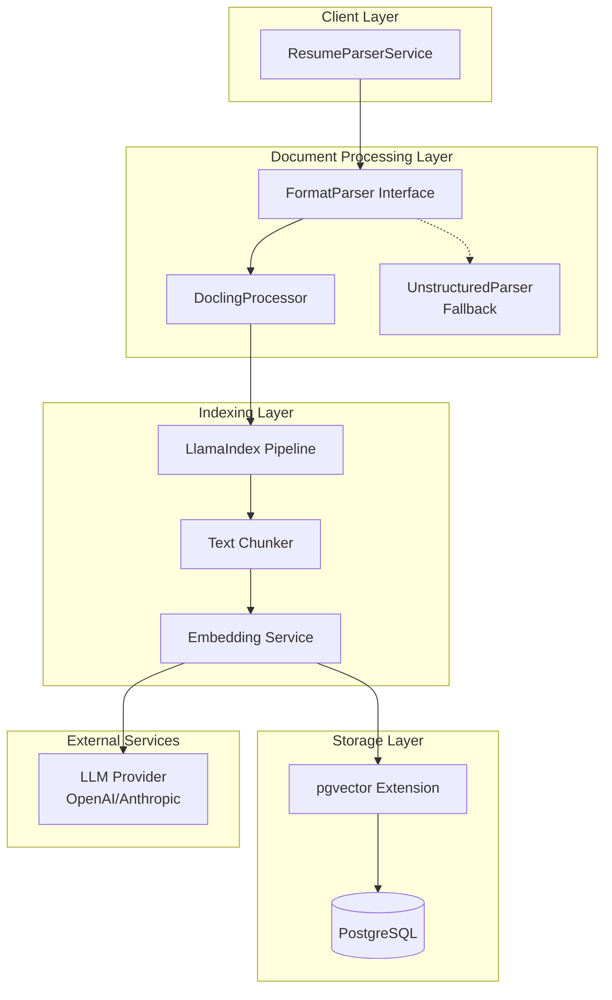

# Design Document: Document Processing Migration

## Overview

Миграция системы обработки документов с Unstructured API на новый стек: LlamaIndex + Docling + pgvector. Новая архитектура обеспечит:

- Локальную обработку документов через Docling (Python библиотека IBM)
- Семантический поиск по содержимому резюме через pgvector
- Гибкую интеграцию с различными LLM провайдерами через LlamaIndex
- Обратную совместимость с существующим API через интерфейс FormatParser

## Architecture



## Components and Interfaces

### 1. DoclingProcessor

Основной компонент для парсинга документов, заменяющий UnstructuredParser.

```typescript
interface DoclingConfig {
  /** Таймаут обработки в миллисекундах */
  timeout?: number;
  /** Включить OCR для сканированных документов */
  enableOcr?: boolean;
  /** Язык OCR (по умолчанию: auto) */
  ocrLanguage?: string;
}

interface DoclingResult {
  /** Извлечённый текст */
  text: string;
  /** Метаданные документа */
  metadata: {
    pageCount?: number;
    title?: string;
    author?: string;
    createdAt?: Date;
  };
  /** Структурированные элементы (таблицы, списки) */
  elements: DocumentElement[];
}

interface DocumentElement {
  type: 'paragraph' | 'heading' | 'list' | 'table' | 'image';
  content: string;
  level?: number; // для заголовков
  rows?: string[][]; // для таблиц
}

class DoclingProcessor implements FormatParser {
  constructor(config?: DoclingConfig);
  
  /** Извлекает текст из документа (совместимость с FormatParser) */
  extractText(content: Buffer, filename?: string): Promise<string>;
  
  /** Извлекает структурированный результат */
  extractStructured(content: Buffer, filename?: string): Promise<DoclingResult>;
}
```

### 2. EmbeddingService

Сервис генерации векторных эмбеддингов через LlamaIndex.

```typescript
interface EmbeddingConfig {
  /** Провайдер эмбеддингов */
  provider: 'openai' | 'anthropic' | 'local';
  /** Модель для эмбеддингов */
  model: string;
  /** Размер чанка текста */
  chunkSize: number;
  /** Перекрытие между чанками */
  chunkOverlap: number;
  /** Размерность вектора */
  dimensions: number;
}

interface TextChunk {
  /** Текст чанка */
  text: string;
  /** Индекс чанка в документе */
  index: number;
  /** Начальная позиция в исходном тексте */
  startOffset: number;
  /** Конечная позиция в исходном тексте */
  endOffset: number;
}

interface EmbeddingResult {
  /** ID исходного документа */
  documentId: string;
  /** Чанки с эмбеддингами */
  chunks: Array<{
    chunk: TextChunk;
    embedding: number[];
  }>;
}

class EmbeddingService {
  constructor(config: EmbeddingConfig);
  
  /** Генерирует эмбеддинги для текста */
  embed(text: string, documentId: string): Promise<EmbeddingResult>;
  
  /** Генерирует эмбеддинг для поискового запроса */
  embedQuery(query: string): Promise<number[]>;
}
```

### 3. VectorStore

Хранилище векторов на базе pgvector.

```typescript
interface VectorStoreConfig {
  /** Строка подключения к PostgreSQL */
  connectionString: string;
  /** Имя таблицы для эмбеддингов */
  tableName: string;
  /** Размерность векторов */
  dimensions: number;
}

interface StoredEmbedding {
  id: string;
  documentId: string;
  chunkIndex: number;
  chunkText: string;
  embedding: number[];
  metadata: Record<string, unknown>;
  createdAt: Date;
}

interface SearchResult {
  documentId: string;
  chunkText: string;
  chunkIndex: number;
  similarity: number;
  metadata: Record<string, unknown>;
}

interface SearchOptions {
  /** Количество результатов */
  topK: number;
  /** Минимальный порог схожести (0-1) */
  threshold?: number;
  /** Фильтр по метаданным */
  filter?: {
    documentIds?: string[];
    candidateId?: string;
    dateFrom?: Date;
    dateTo?: Date;
  };
}

class VectorStore {
  constructor(config: VectorStoreConfig);
  
  /** Инициализирует таблицу и индексы */
  initialize(): Promise<void>;
  
  /** Сохраняет эмбеддинги */
  store(result: EmbeddingResult, metadata?: Record<string, unknown>): Promise<void>;
  
  /** Удаляет эмбеддинги документа */
  deleteByDocument(documentId: string): Promise<void>;
  
  /** Семантический поиск */
  search(queryEmbedding: number[], options: SearchOptions): Promise<SearchResult[]>;
}
```

### 4. DocumentIndexer

Оркестратор индексации документов через LlamaIndex.

```typescript
interface IndexerConfig {
  embedding: EmbeddingConfig;
  vectorStore: VectorStoreConfig;
  /** Feature flag для использования нового процессора */
  useDocling: boolean;
  /** Fallback на Unstructured при ошибках */
  fallbackToUnstructured: boolean;
}

class DocumentIndexer {
  constructor(config: IndexerConfig);
  
  /** Индексирует документ */
  index(
    content: Buffer,
    documentId: string,
    metadata?: Record<string, unknown>
  ): Promise<void>;
  
  /** Переиндексирует документ (удаляет старые эмбеддинги) */
  reindex(
    content: Buffer,
    documentId: string,
    metadata?: Record<string, unknown>
  ): Promise<void>;
  
  /** Удаляет документ из индекса */
  remove(documentId: string): Promise<void>;
  
  /** Семантический поиск по документам */
  search(query: string, options: SearchOptions): Promise<SearchResult[]>;
}
```

## Data Models

### PostgreSQL Schema для pgvector

```sql
-- Включение расширения pgvector
CREATE EXTENSION IF NOT EXISTS vector;

-- Таблица для хранения эмбеддингов документов
CREATE TABLE document_embeddings (
  id UUID PRIMARY KEY DEFAULT gen_random_uuid(),
  document_id VARCHAR(255) NOT NULL,
  chunk_index INTEGER NOT NULL,
  chunk_text TEXT NOT NULL,
  embedding vector(1536), -- размерность зависит от модели
  metadata JSONB DEFAULT '{}',
  created_at TIMESTAMP WITH TIME ZONE DEFAULT NOW(),
  updated_at TIMESTAMP WITH TIME ZONE DEFAULT NOW(),
  
  CONSTRAINT unique_document_chunk UNIQUE (document_id, chunk_index)
);

-- Индекс для быстрого поиска по document_id
CREATE INDEX idx_embeddings_document_id ON document_embeddings(document_id);

-- Индекс для векторного поиска (IVFFlat для больших объёмов)
CREATE INDEX idx_embeddings_vector ON document_embeddings 
  USING ivfflat (embedding vector_cosine_ops)
  WITH (lists = 100);

-- Индекс для фильтрации по метаданным
CREATE INDEX idx_embeddings_metadata ON document_embeddings USING gin(metadata);
```

### Drizzle Schema

```typescript
import { pgTable, uuid, varchar, integer, text, timestamp, jsonb, index } from 'drizzle-orm/pg-core';
import { vector } from 'pgvector/drizzle-orm';

export const documentEmbeddings = pgTable('document_embeddings', {
  id: uuid('id').primaryKey().defaultRandom(),
  documentId: varchar('document_id', { length: 255 }).notNull(),
  chunkIndex: integer('chunk_index').notNull(),
  chunkText: text('chunk_text').notNull(),
  embedding: vector('embedding', { dimensions: 1536 }),
  metadata: jsonb('metadata').default({}),
  createdAt: timestamp('created_at', { withTimezone: true }).defaultNow(),
  updatedAt: timestamp('updated_at', { withTimezone: true }).defaultNow(),
}, (table) => ({
  documentIdIdx: index('idx_embeddings_document_id').on(table.documentId),
  uniqueChunk: unique('unique_document_chunk').on(table.documentId, table.chunkIndex),
}));


## Correctness Properties

*A property is a characteristic or behavior that should hold true across all valid executions of a system—essentially, a formal statement about what the system should do. Properties serve as the bridge between human-readable specifications and machine-verifiable correctness guarantees.*


### Property 1: Document parsing preserves content

*For any* valid document (PDF, DOCX) with known text content, parsing the document should extract all textual content without loss. The extracted text should contain all words from the original document.

**Validates: Requirements 1.1, 1.2, 1.3**

### Property 2: Chunking produces valid segments

*For any* text and chunking configuration (chunkSize, chunkOverlap), the resulting chunks should:
- Have length ≤ chunkSize
- Have overlap with adjacent chunks equal to chunkOverlap (except first/last)
- When concatenated (accounting for overlap), reconstruct the original text
- Each chunk should have valid metadata (index, startOffset, endOffset)

**Validates: Requirements 2.2, 2.3**

### Property 3: Embedding storage round-trip

*For any* valid embedding result, storing it in VectorStore and then querying by documentId should return equivalent data: same chunkText, same chunkIndex, same embedding vector (within floating-point tolerance), and same metadata.

**Validates: Requirements 3.1, 3.2**

### Property 4: Document deletion removes all embeddings

*For any* document with stored embeddings, calling deleteByDocument should result in zero embeddings remaining for that documentId.

**Validates: Requirements 3.3**

### Property 5: Reindexing replaces embeddings atomically

*For any* document that is reindexed with new content, the VectorStore should contain only the new embeddings, with no remnants of old embeddings.

**Validates: Requirements 3.4**

### Property 6: Search results are ordered by similarity

*For any* search query, the returned results should be ordered by similarity score in descending order, and all results should have similarity ≥ threshold (if specified).

**Validates: Requirements 4.1, 4.3**

### Property 7: Search filters are applied correctly

*For any* search with metadata filters, all returned results should match the filter criteria (documentIds, candidateId, date range).

**Validates: Requirements 4.2**

### Property 8: Parser equivalence

*For any* valid document, both DoclingProcessor and UnstructuredParser should extract text that is semantically equivalent (same words, possibly different formatting).

**Validates: Requirements 6.2**

## Error Handling

### Document Processing Errors

| Error Code | Condition | Action |
|------------|-----------|--------|
| `CORRUPTED_FILE` | Документ повреждён или не читается | Вернуть ошибку с описанием |
| `PASSWORD_PROTECTED` | Документ защищён паролем | Вернуть ошибку с кодом |
| `UNSUPPORTED_FORMAT` | Неподдерживаемый формат файла | Вернуть список поддерживаемых форматов |
| `EMPTY_CONTENT` | Документ не содержит текста | Вернуть ошибку, предложить OCR |
| `PARSE_TIMEOUT` | Превышено время обработки | Вернуть ошибку с timeout |

### Embedding Errors

| Error Code | Condition | Action |
|------------|-----------|--------|
| `PROVIDER_UNAVAILABLE` | LLM провайдер недоступен | Retry с exponential backoff, затем ошибка |
| `RATE_LIMITED` | Превышен лимит запросов | Retry после указанного времени |
| `INVALID_INPUT` | Текст слишком длинный/короткий | Вернуть ошибку с ограничениями |

### Fallback Strategy

```typescript
async function processDocument(content: Buffer, filename: string): Promise<string> {
  if (config.useDocling) {
    try {
      return await doclingProcessor.extractText(content, filename);
    } catch (error) {
      if (config.fallbackToUnstructured) {
        logger.warn('Docling failed, falling back to Unstructured', { error });
        return await unstructuredParser.extractText(content, filename);
      }
      throw error;
    }
  }
  return await unstructuredParser.extractText(content, filename);
}
```

## Testing Strategy

### Unit Tests

- Тестирование отдельных компонентов с моками
- Проверка edge cases (пустые документы, большие файлы)
- Тестирование error handling

### Property-Based Tests

Используем **fast-check** для property-based тестирования в TypeScript:

```typescript
import fc from 'fast-check';

// Property 2: Chunking produces valid segments
fc.assert(
  fc.property(
    fc.string({ minLength: 100, maxLength: 10000 }),
    fc.integer({ min: 50, max: 500 }),
    fc.integer({ min: 0, max: 100 }),
    (text, chunkSize, chunkOverlap) => {
      fc.pre(chunkOverlap < chunkSize);
      const chunks = chunkText(text, chunkSize, chunkOverlap);
      
      // All chunks have valid size
      chunks.forEach(chunk => {
        expect(chunk.text.length).toBeLessThanOrEqual(chunkSize);
      });
      
      // Chunks have valid metadata
      chunks.forEach((chunk, i) => {
        expect(chunk.index).toBe(i);
        expect(chunk.startOffset).toBeGreaterThanOrEqual(0);
        expect(chunk.endOffset).toBeLessThanOrEqual(text.length);
      });
    }
  ),
  { numRuns: 100 }
);
```

### Integration Tests

- End-to-end тестирование pipeline: документ → парсинг → эмбеддинг → поиск
- Тестирование с реальной PostgreSQL + pgvector
- Тестирование fallback логики

### Test Configuration

- Property tests: минимум 100 итераций
- Таймаут для integration tests: 30 секунд
- Тестовые документы: PDF, DOCX с известным содержимым
