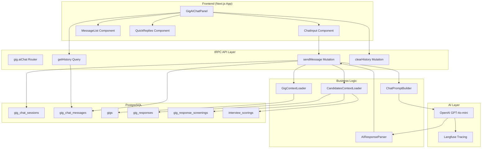
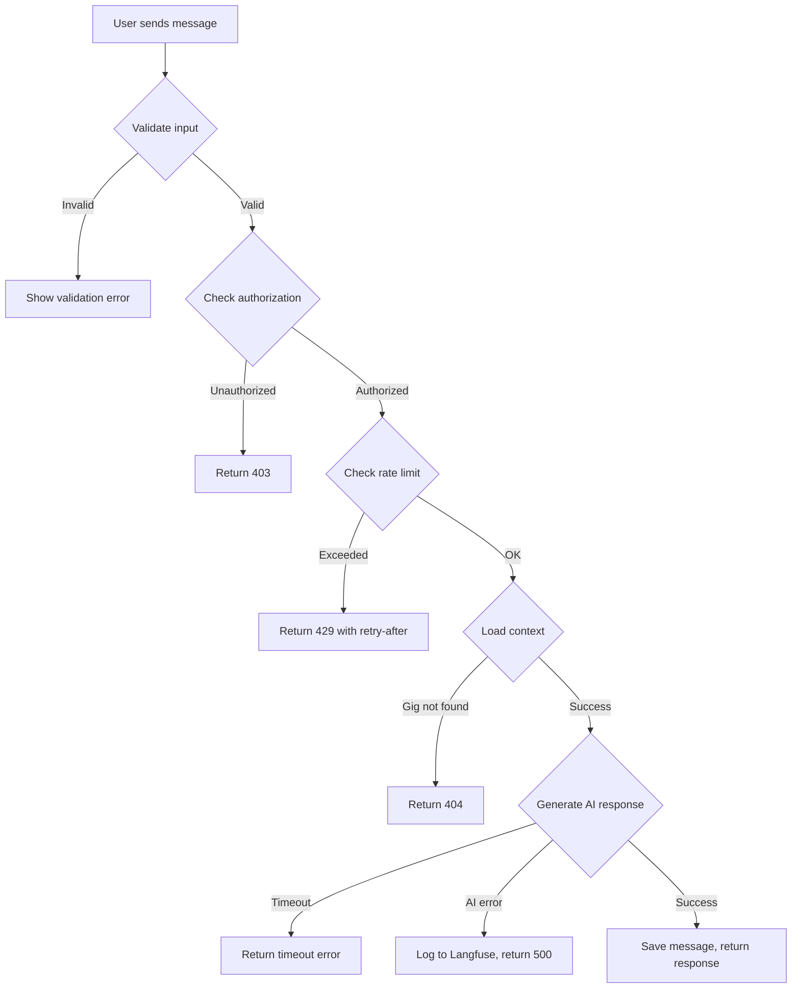

# Design Document: Gig AI Chat

## Overview

AI чат для gig заданий — это интерактивный помощник, позволяющий рекрутерам задавать вопросы о кандидатах в естественной форме. Система загружает контекст gig задания и всех откликов, обрабатывает запросы через LLM и возвращает структурированные ответы с аналитикой.

## Architecture



## Components and Interfaces

### Database Schema

#### gig_chat_sessions
Хранит сессии чата для каждого gig.

```typescript
export const gigChatSession = pgTable("gig_chat_sessions", {
  id: uuid("id").primaryKey().default(sql`uuid_generate_v7()`),
  gigId: uuid("gig_id")
    .notNull()
    .references(() => gig.id, { onDelete: "cascade" }),
  userId: text("user_id").notNull(),
  messageCount: integer("message_count").default(0),
  lastMessageAt: timestamp("last_message_at", { withTimezone: true }),
  createdAt: timestamp("created_at", { withTimezone: true }).defaultNow().notNull(),
  updatedAt: timestamp("updated_at", { withTimezone: true }).defaultNow().notNull(),
}, (table) => ({
  gigUserUnique: unique().on(table.gigId, table.userId),
  gigIdx: index("gig_chat_session_gig_idx").on(table.gigId),
  userIdx: index("gig_chat_session_user_idx").on(table.userId),
}));
```

#### gig_chat_messages
Хранит сообщения в чате.

```typescript
export const gigChatMessageRoleEnum = pgEnum("gig_chat_message_role", [
  "user",
  "assistant",
]);

export const gigChatMessage = pgTable("gig_chat_messages", {
  id: uuid("id").primaryKey().default(sql`uuid_generate_v7()`),
  sessionId: uuid("session_id")
    .notNull()
    .references(() => gigChatSession.id, { onDelete: "cascade" }),
  role: gigChatMessageRoleEnum("role").notNull(),
  content: text("content").notNull(),
  quickReplies: jsonb("quick_replies").$type<string[]>(),
  metadata: jsonb("metadata").$type<{
    tokensUsed?: number;
    latencyMs?: number;
    candidatesMentioned?: string[];
  }>(),
  createdAt: timestamp("created_at", { withTimezone: true }).defaultNow().notNull(),
}, (table) => ({
  sessionIdx: index("gig_chat_message_session_idx").on(table.sessionId),
  sessionCreatedIdx: index("gig_chat_message_session_created_idx").on(
    table.sessionId,
    table.createdAt,
  ),
}));
```

### tRPC Router Interface

```typescript
// packages/api/src/routers/gig/ai-chat.ts

export const aiChatRouter = router({
  sendMessage: protectedProcedure
    .input(z.object({
      gigId: z.string().uuid(),
      message: z.string().min(1).max(2000),
    }))
    .mutation(async ({ input, ctx }) => {
      // Returns: { message: string, quickReplies: string[], metadata: object }
    }),

  getHistory: protectedProcedure
    .input(z.object({
      gigId: z.string().uuid(),
      limit: z.number().min(1).max(50).default(50),
    }))
    .query(async ({ input, ctx }) => {
      // Returns: { messages: ChatMessage[], hasMore: boolean }
    }),

  clearHistory: protectedProcedure
    .input(z.object({
      gigId: z.string().uuid(),
    }))
    .mutation(async ({ input, ctx }) => {
      // Returns: { success: boolean }
    }),
});
```

### Context Loaders

#### GigContextLoader
Загружает полную информацию о gig задании.

```typescript
interface GigContext {
  id: string;
  title: string;
  description: string | null;
  requirements: GigRequirements | null;
  type: GigType;
  budgetMin: number | null;
  budgetMax: number | null;
  budgetCurrency: string;
  deadline: Date | null;
  estimatedDuration: string | null;
  customBotInstructions: string | null;
}

async function loadGigContext(gigId: string): Promise<GigContext>
```

#### CandidatesContextLoader
Загружает агрегированные данные всех кандидатов.

```typescript
interface CandidateContext {
  id: string;
  candidateId: string;
  candidateName: string | null;
  proposedPrice: number | null;
  proposedCurrency: string;
  proposedDeliveryDays: number | null;
  coverLetter: string | null;
  experience: string | null;
  skills: string[] | null;
  rating: string | null;
  status: GigResponseStatus;
  hrSelectionStatus: GigHrSelectionStatus | null;
  // Screening data
  screeningScore: number | null;
  screeningDetailedScore: number | null;
  screeningAnalysis: string | null;
  // Interview data
  interviewScore: number | null;
  interviewDetailedScore: number | null;
  interviewAnalysis: string | null;
  // Ranking data
  compositeScore: number | null;
  strengths: string[] | null;
  weaknesses: string[] | null;
  recommendation: GigRecommendation | null;
}

interface CandidatesContext {
  candidates: CandidateContext[];
  stats: {
    total: number;
    byStatus: Record<GigResponseStatus, number>;
    byRecommendation: Record<GigRecommendation, number>;
    avgPrice: number | null;
    avgDeliveryDays: number | null;
    avgScreeningScore: number | null;
    avgInterviewScore: number | null;
  };
}

async function loadCandidatesContext(gigId: string): Promise<CandidatesContext>
```

### Prompt Builder

```typescript
function buildGigAIChatPrompt(
  userMessage: string,
  gigContext: GigContext,
  candidatesContext: CandidatesContext,
  conversationHistory: Array<{ role: "user" | "assistant"; content: string }>,
): string
```

Промпт включает:
1. Системную инструкцию с ролью AI-помощника
2. Контекст gig задания (требования, бюджет, сроки)
3. Сводку по кандидатам (статистика, топ кандидаты)
4. Детальные данные кандидатов (если их <= 20)
5. Историю диалога (последние 10 сообщений)
6. Текущий вопрос пользователя
7. Инструкции по формату ответа

### AI Response Schema

```typescript
const aiChatResponseSchema = z.object({
  message: z.string(),
  quickReplies: z.array(z.string()).max(4).optional(),
  candidatesMentioned: z.array(z.string()).optional(),
  analysisType: z.enum([
    "single_candidate",
    "comparison",
    "ranking",
    "statistics",
    "recommendation",
    "general",
  ]).optional(),
});
```

### React Components

#### GigAIChatPanel
Основной компонент чата, отображается в slide-over панели.

```typescript
interface GigAIChatPanelProps {
  gigId: string;
  isOpen: boolean;
  onClose: () => void;
}

function GigAIChatPanel({ gigId, isOpen, onClose }: GigAIChatPanelProps): JSX.Element
```

#### ChatMessageList
Отображает историю сообщений с поддержкой markdown.

```typescript
interface ChatMessage {
  id: string;
  role: "user" | "assistant";
  content: string;
  quickReplies?: string[];
  createdAt: Date;
}

interface ChatMessageListProps {
  messages: ChatMessage[];
  isLoading: boolean;
}
```

#### ChatInput
Поле ввода с поддержкой Enter для отправки.

```typescript
interface ChatInputProps {
  onSend: (message: string) => void;
  disabled: boolean;
  placeholder?: string;
}
```

#### QuickReplies
Кнопки быстрых ответов.

```typescript
interface QuickRepliesProps {
  replies: string[];
  onSelect: (reply: string) => void;
  disabled: boolean;
}
```

## Data Models

### Chat Session State

```typescript
interface ChatSessionState {
  sessionId: string | null;
  messages: ChatMessage[];
  isLoading: boolean;
  error: string | null;
  hasMore: boolean;
}
```

### Candidate Summary for Context

Для оптимизации токенов, кандидаты суммаризируются:

```typescript
interface CandidateSummary {
  name: string;
  price: string; // "15000 RUB" or "не указана"
  delivery: string; // "5 дней" or "не указано"
  screeningScore: string; // "85/100" or "не оценен"
  interviewScore: string; // "72/100" or "не проведено"
  compositeScore: string; // "78/100" or "не рассчитан"
  recommendation: string; // "Рекомендован" or "Не оценен"
  status: string; // "Новый", "Интервью" и т.д.
  strengths: string; // "Опыт, Цена" or "не определены"
  weaknesses: string; // "Сроки" or "не определены"
}
```


## Correctness Properties

*A property is a characteristic or behavior that should hold true across all valid executions of a system—essentially, a formal statement about what the system should do. Properties serve as the bridge between human-readable specifications and machine-verifiable correctness guarantees.*

### Property 1: Session Creation with Correct References

*For any* user and gig combination, when opening AI chat for the first time, the system should create a session with correct gigId and userId references, and subsequent opens should return the same session.

**Validates: Requirements 1.1, 1.2**

### Property 2: Message Persistence Round-Trip

*For any* chat session, messages sent by user and responses from AI should be persisted to database and retrievable via getHistory, maintaining correct order and content.

**Validates: Requirements 1.3, 9.3**

### Property 3: Message History Limit

*For any* chat session, the number of messages returned by getHistory should never exceed 50, regardless of how many messages were sent.

**Validates: Requirements 1.4**

### Property 4: Gig Context Completeness

*For any* gig with data, the loaded GigContext should include all required fields (title, description, requirements, type, budget, deadline, estimatedDuration) and customBotInstructions if configured.

**Validates: Requirements 2.1, 2.2, 2.3**

### Property 5: Candidates Context Completeness

*For any* gig with responses, the loaded CandidatesContext should include all candidates with their screening scores, interview scores, ranking data, and HR status.

**Validates: Requirements 3.1, 3.2, 3.3, 3.4, 3.5, 3.6**

### Property 6: Authorization Access Control

*For any* user attempting to access gig AI chat, if the user does not belong to the workspace that owns the gig, the system should return 403 error and not expose any data.

**Validates: Requirements 10.4, 14.1, 14.2, 14.3**

### Property 7: Response Schema Validation

*For any* successful sendMessage call, the response should contain message (string), quickReplies (array of strings, max 4), and metadata object.

**Validates: Requirements 10.6**

### Property 8: Candidate Data Isolation

*For any* AI chat response, mentioned candidates should only be from the requested gig, never from other gigs in the same workspace.

**Validates: Requirements 14.4**

### Property 9: Rate Limiting Enforcement

*For any* user, sending more than 20 messages within 1 minute should result in rate limit error for subsequent messages until the window resets.

**Validates: Requirements 12.4**

### Property 10: Large Candidate Pool Handling

*For any* gig with more than 50 candidates, the system should summarize candidate data in context to prevent token overflow, while still providing accurate statistics.

**Validates: Requirements 12.1, 12.2**

## Error Handling

### Error Categories

| Error Type | HTTP Code | User Message | Recovery Action |
|------------|-----------|--------------|-----------------|
| Unauthorized | 401 | "Необходима авторизация" | Redirect to login |
| Forbidden | 403 | "Нет доступа к этому заданию" | Show access denied |
| Not Found | 404 | "Задание не найдено" | Redirect to gigs list |
| Rate Limited | 429 | "Слишком много запросов. Подождите минуту" | Show countdown |
| AI Generation Failed | 500 | "Не удалось получить ответ. Попробуйте ещё раз" | Show retry button |
| Invalid Input | 400 | "Сообщение слишком длинное (макс. 2000 символов)" | Highlight input |

### Error Handling Flow



## Testing Strategy

### Unit Tests

Unit tests focus on specific examples and edge cases:

1. **Context Loaders**
   - Load gig context with all fields populated
   - Load gig context with minimal data
   - Load candidates context with screening and interview data
   - Load candidates context with no candidates

2. **Prompt Builder**
   - Build prompt with full context
   - Build prompt with empty conversation history
   - Build prompt with 50+ candidates (summarization)

3. **Response Parser**
   - Parse valid AI response with all fields
   - Parse response with missing optional fields
   - Handle malformed JSON gracefully

4. **Authorization**
   - User with access can send messages
   - User without access gets 403
   - Non-existent gig returns 404

### Property-Based Tests

Property tests use fast-check library with minimum 100 iterations per test.

```typescript
// Example property test structure
import { fc } from "@fast-check/vitest";

describe("Gig AI Chat Properties", () => {
  // Property 1: Session Creation
  it.prop([fc.uuid(), fc.uuid()])("creates session with correct references", 
    async (gigId, userId) => {
      // Test implementation
    }
  );

  // Property 6: Authorization
  it.prop([fc.uuid(), fc.uuid()])("denies access to unauthorized users",
    async (gigId, unauthorizedUserId) => {
      // Test implementation
    }
  );
});
```

### Integration Tests

1. **Full Chat Flow**
   - Send message → receive response → verify persistence
   - Load history → verify order and content
   - Clear history → verify empty state

2. **Streaming**
   - Verify partial responses arrive before completion
   - Verify final response is saved correctly

3. **Rate Limiting**
   - Send 20 messages → all succeed
   - Send 21st message → rate limited
   - Wait 60 seconds → can send again

### Test Configuration

```typescript
// vitest.config.ts
export default defineConfig({
  test: {
    include: ["**/*.test.ts", "**/*.property.test.ts"],
    coverage: {
      include: ["src/routers/gig/ai-chat.ts", "src/services/gig-chat/**"],
    },
  },
});
```

### Test Tags

Each property test must be tagged with:
- **Feature: gig-ai-chat**
- **Property {number}: {property_text}**
- **Validates: Requirements X.Y**
