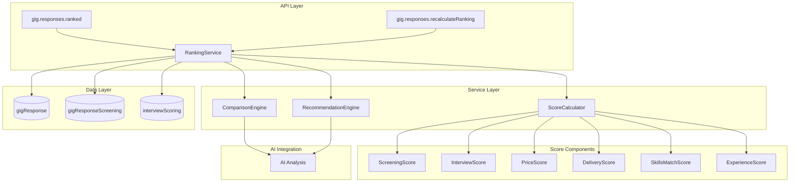

# Design Document: Gig Candidate Ranking

## Overview

Система ранжирования кандидатов для gig заданий предоставляет комплексную оценку и сравнительный анализ всех откликнувшихся кандидатов. Система вычисляет взвешенную оценку на основе множества факторов (скрининг, интервью, цена, сроки, навыки, опыт), формирует рейтинг и генерирует рекомендации для рекрутера.

## Architecture



## Components and Interfaces

### 1. Database Schema Extensions

Расширение таблицы `gig_responses` новыми полями для хранения результатов ранжирования:

```typescript
// packages/db/src/schema/gig/response.ts

// Новый enum для рекомендаций
export const gigRecommendationEnum = pgEnum("gig_recommendation", [
  "HIGHLY_RECOMMENDED",
  "RECOMMENDED", 
  "NEUTRAL",
  "NOT_RECOMMENDED",
]);

// Новые поля в gigResponse таблице
{
  // Оценки по компонентам (0-100)
  compositeScore: integer("composite_score"),
  priceScore: integer("price_score"),
  deliveryScore: integer("delivery_score"),
  skillsMatchScore: integer("skills_match_score"),
  experienceScore: integer("experience_score"),
  
  // Позиция в рейтинге
  rankingPosition: integer("ranking_position"),
  
  // Анализ и рекомендации
  rankingAnalysis: text("ranking_analysis"),
  strengths: jsonb("strengths").$type<string[]>(),
  weaknesses: jsonb("weaknesses").$type<string[]>(),
  recommendation: gigRecommendationEnum("recommendation"),
  
  // Метаданные ранжирования
  rankedAt: timestamp("ranked_at", { withTimezone: true, mode: "date" }),
}
```

### 2. Score Calculator Service

```typescript
// packages/api/src/services/gig/ranking/score-calculator.ts

interface ScoreWeights {
  screening: number;      // default: 0.25
  interview: number;      // default: 0.25
  price: number;          // default: 0.15
  delivery: number;       // default: 0.10
  skillsMatch: number;    // default: 0.15
  experience: number;     // default: 0.10
}

interface CandidateScores {
  screeningScore: number | null;
  interviewScore: number | null;
  priceScore: number | null;
  deliveryScore: number | null;
  skillsMatchScore: number | null;
  experienceScore: number | null;
  compositeScore: number;
}

interface ScoreCalculatorInput {
  response: GigResponse;
  screening: GigResponseScreening | null;
  interviewScoring: InterviewScoring | null;
  gig: Gig;
  allResponses: GigResponse[]; // для сравнительного анализа цен/сроков
}

class ScoreCalculator {
  calculatePriceScore(
    proposedPrice: number | null,
    budgetMin: number | null,
    budgetMax: number | null,
    allPrices: number[]
  ): number | null;
  
  calculateDeliveryScore(
    proposedDays: number | null,
    deadline: Date | null,
    allDeliveryDays: number[]
  ): number | null;
  
  calculateSkillsMatchScore(
    candidateSkills: string[] | null,
    requiredSkills: string[],
    niceToHaveSkills: string[]
  ): number | null;
  
  calculateExperienceScore(
    experience: string | null,
    requirements: GigRequirements | null
  ): number | null;
  
  calculateCompositeScore(
    scores: Partial<CandidateScores>,
    weights: ScoreWeights
  ): number;
}
```

### 3. Comparison Engine

```typescript
// packages/api/src/services/gig/ranking/comparison-engine.ts

interface CandidateComparison {
  candidateId: string;
  percentileRanks: {
    overall: number;
    price: number;
    delivery: number;
    skills: number;
    experience: number;
    screening: number;
    interview: number;
  };
  strengths: string[];
  weaknesses: string[];
  bestInCategories: string[]; // категории где кандидат лучший
}

interface ComparisonResult {
  comparisons: CandidateComparison[];
  topCandidates: string[]; // top 3 candidate IDs
  categoryLeaders: Record<string, string>; // category -> candidateId
}

class ComparisonEngine {
  compareAllCandidates(
    candidates: Array<{
      response: GigResponse;
      scores: CandidateScores;
    }>
  ): ComparisonResult;
  
  calculatePercentileRank(
    value: number,
    allValues: number[]
  ): number;
  
  identifyStrengths(
    percentileRanks: Record<string, number>,
    threshold: number // default: 75
  ): string[];
  
  identifyWeaknesses(
    percentileRanks: Record<string, number>,
    threshold: number // default: 25
  ): string[];
}
```

### 4. Recommendation Engine

```typescript
// packages/api/src/services/gig/ranking/recommendation-engine.ts

type RecommendationStatus = 
  | "HIGHLY_RECOMMENDED"
  | "RECOMMENDED"
  | "NEUTRAL"
  | "NOT_RECOMMENDED";

interface RecommendationResult {
  status: RecommendationStatus;
  analysis: string;
  topStrengths: string[]; // max 3
  topWeaknesses: string[]; // max 3
}

class RecommendationEngine {
  generateRecommendation(
    compositeScore: number,
    comparison: CandidateComparison,
    gig: Gig
  ): RecommendationResult;
  
  determineStatus(compositeScore: number): RecommendationStatus;
  
  generateAnalysis(
    response: GigResponse,
    scores: CandidateScores,
    comparison: CandidateComparison,
    gig: Gig
  ): Promise<string>; // AI-generated
}
```

### 5. Ranking Service (Main Orchestrator)

```typescript
// packages/api/src/services/gig/ranking/ranking-service.ts

interface RankedCandidate {
  response: GigResponse;
  scores: CandidateScores;
  comparison: CandidateComparison;
  recommendation: RecommendationResult;
  rankingPosition: number;
}

interface RankingResult {
  candidates: RankedCandidate[];
  totalCount: number;
  rankedAt: Date;
}

class RankingService {
  async calculateRankings(gigId: string): Promise<RankingResult>;
  
  async getRankedCandidates(
    gigId: string,
    options: {
      minScore?: number;
      recommendation?: RecommendationStatus[];
      limit?: number;
      offset?: number;
    }
  ): Promise<RankingResult>;
  
  async recalculateRankings(gigId: string): Promise<void>;
}
```

### 6. API Endpoints

```typescript
// packages/api/src/routers/gig/responses/ranked.ts

export const ranked = protectedProcedure
  .input(z.object({
    gigId: z.uuid(),
    workspaceId: workspaceIdSchema,
    minScore: z.number().min(0).max(100).optional(),
    recommendation: z.array(z.enum([
      "HIGHLY_RECOMMENDED",
      "RECOMMENDED",
      "NEUTRAL",
      "NOT_RECOMMENDED"
    ])).optional(),
    limit: z.number().min(1).max(100).default(20),
    offset: z.number().min(0).default(0),
  }))
  .query(async ({ ctx, input }) => {
    // Returns ranked candidates with all scores and analysis
  });

// packages/api/src/routers/gig/responses/recalculate-ranking.ts

export const recalculateRanking = protectedProcedure
  .input(z.object({
    gigId: z.uuid(),
    workspaceId: workspaceIdSchema,
  }))
  .mutation(async ({ ctx, input }) => {
    // Triggers full ranking recalculation
  });
```

## Data Models

### Score Calculation Formulas

#### Price Score (0-100)
```
Если цена в пределах бюджета:
  priceScore = 100 - ((proposedPrice - budgetMin) / (budgetMax - budgetMin)) * 50

Если цена ниже бюджета:
  priceScore = 100

Если цена выше бюджета:
  priceScore = max(0, 100 - ((proposedPrice - budgetMax) / budgetMax) * 100)

Сравнительная корректировка:
  percentile = позиция в отсортированном списке цен / количество кандидатов
  finalPriceScore = priceScore * 0.7 + (1 - percentile) * 100 * 0.3
```

#### Delivery Score (0-100)
```
Если срок до дедлайна:
  daysToDeadline = deadline - today
  deliveryScore = min(100, (daysToDeadline / proposedDeliveryDays) * 50 + 50)

Если срок после дедлайна:
  deliveryScore = max(0, 50 - ((proposedDeliveryDays - daysToDeadline) / daysToDeadline) * 50)

Сравнительная корректировка:
  percentile = позиция в отсортированном списке сроков / количество кандидатов
  finalDeliveryScore = deliveryScore * 0.7 + (1 - percentile) * 100 * 0.3
```

#### Skills Match Score (0-100)
```
requiredMatches = количество совпадений с required_skills
niceToHaveMatches = количество совпадений с nice_to_have_skills

requiredScore = (requiredMatches / required_skills.length) * 70
niceToHaveScore = (niceToHaveMatches / nice_to_have_skills.length) * 30

skillsMatchScore = requiredScore + niceToHaveScore
```

#### Experience Score (0-100)
```
Используется AI для анализа текста experience относительно requirements.
Возвращает оценку 0-100 на основе:
- Релевантность опыта к типу задания
- Соответствие experience_level
- Наличие похожих проектов в портфолио
```

#### Composite Score (0-100)
```
compositeScore = Σ(score_i * weight_i) / Σ(weight_i для доступных scores)

Где weights по умолчанию:
- screening: 0.25
- interview: 0.25
- price: 0.15
- delivery: 0.10
- skillsMatch: 0.15
- experience: 0.10
```

### Percentile Calculation
```
percentile = (количество значений < текущего) / (общее количество - 1) * 100
```

### Strength/Weakness Thresholds
```
strength: percentile >= 75
weakness: percentile <= 25
```

## Error Handling

| Error Case | Handling Strategy |
|------------|-------------------|
| No candidates for gig | Return empty result with appropriate message |
| Single candidate | Calculate scores, skip comparative analysis, assign NEUTRAL recommendation |
| Missing price data for all | Exclude price from composite calculation, redistribute weights |
| Missing delivery data for all | Exclude delivery from composite calculation, redistribute weights |
| AI analysis failure | Use fallback template-based analysis |
| Database transaction failure | Rollback all changes, return error |
| Invalid score values | Clamp to 0-100 range, log warning |


## Correctness Properties

*A property is a characteristic or behavior that should hold true across all valid executions of a system-essentially, a formal statement about what the system should do. Properties serve as the bridge between human-readable specifications and machine-verifiable correctness guarantees.*

### Property Reflection

After analyzing the acceptance criteria, the following redundancies were identified and consolidated:
- Requirements 1.1-1.5 (score fields 0-100) consolidated into Property 1
- Requirements 4.1-4.4 (recommendation thresholds) consolidated into Property 4
- Requirements 5.2-5.3 (API filtering) consolidated into Property 7

### Properties

**Property 1: Score fields are bounded**
*For any* GigResponse with calculated scores, all score fields (compositeScore, priceScore, deliveryScore, skillsMatchScore, experienceScore) SHALL be integers in the range [0, 100] or null.
**Validates: Requirements 1.1, 1.2, 1.3, 1.4, 1.5**

**Property 2: Composite score is weighted average**
*For any* set of available scores and weights, the compositeScore SHALL equal the sum of (score × weight) divided by the sum of weights for available scores, rounded to nearest integer.
**Validates: Requirements 2.7, 2.8**

**Property 3: Price score calculation**
*For any* candidate with proposedPrice, given a gig budget and list of all candidate prices, the priceScore SHALL be calculated according to the formula: lower prices relative to budget and other candidates yield higher scores.
**Validates: Requirements 2.3**

**Property 4: Recommendation status matches score thresholds**
*For any* candidate with compositeScore:
- compositeScore >= 80 → HIGHLY_RECOMMENDED
- 60 <= compositeScore < 80 → RECOMMENDED  
- 40 <= compositeScore < 60 → NEUTRAL
- compositeScore < 40 → NOT_RECOMMENDED
**Validates: Requirements 4.1, 4.2, 4.3, 4.4**

**Property 5: Percentile calculation correctness**
*For any* list of n candidates with scores for a criterion, the percentile for candidate i SHALL equal (count of candidates with lower score) / (n - 1) × 100, where n > 1.
**Validates: Requirements 3.3**

**Property 6: Strengths and weaknesses identification**
*For any* candidate, a criterion SHALL appear in strengths if percentile >= 75, and in weaknesses if percentile <= 25. Strengths and weaknesses arrays SHALL have at most 3 elements each.
**Validates: Requirements 3.4, 3.5, 4.6**

**Property 7: API returns sorted and filtered results**
*For any* API request for ranked candidates:
- Results SHALL be sorted by compositeScore descending
- If minScore filter is provided, all results SHALL have compositeScore >= minScore
- If recommendation filter is provided, all results SHALL have matching recommendation status
**Validates: Requirements 5.1, 5.2, 5.3**

**Property 8: Pagination correctness**
*For any* API request with limit L and offset O, the response SHALL contain at most L candidates starting from position O in the full sorted list.
**Validates: Requirements 5.7**

**Property 9: Ranking position uniqueness and ordering**
*For any* gig with n candidates, after ranking:
- Each candidate SHALL have a unique rankingPosition from 1 to n
- Candidate with rankingPosition i SHALL have compositeScore >= candidate with rankingPosition i+1
**Validates: Requirements 1.6, 6.4**

**Property 10: Tiebreaker by creation date**
*For any* two candidates with identical compositeScore, the candidate with earlier createdAt SHALL have a lower (better) rankingPosition.
**Validates: Requirements 8.3**

**Property 11: Rejected candidates excluded from ranking**
*For any* gig, candidates with hrSelectionStatus = REJECTED SHALL NOT appear in the ranked list but SHALL retain their score data.
**Validates: Requirements 8.5**

**Property 12: Skills match score calculation**
*For any* candidate with skills array and gig with required_skills and nice_to_have_skills, skillsMatchScore SHALL equal: (matched_required / total_required) × 70 + (matched_nice_to_have / total_nice_to_have) × 30.
**Validates: Requirements 2.5**

**Property 13: Missing data weight redistribution**
*For any* ranking calculation where a score component is missing for ALL candidates, that component's weight SHALL be redistributed proportionally among available components.
**Validates: Requirements 8.4**

**Property 14: Category leaders identification**
*For any* gig with multiple candidates, the Comparison_Matrix SHALL correctly identify the candidate with the highest score for each criterion as the category leader.
**Validates: Requirements 3.2**

## Testing Strategy

### Property-Based Testing

The system will use **fast-check** library for property-based testing in TypeScript. Each property test will run a minimum of 100 iterations.

**Test Configuration:**
```typescript
import fc from "fast-check";

// Configure minimum iterations
fc.configureGlobal({ numRuns: 100 });
```

### Test Categories

#### Unit Tests (Specific Examples)
- Single candidate ranking (edge case)
- Empty candidate list handling
- API endpoint response structure validation
- Database schema field constraints

#### Property Tests (Universal Properties)
- Score bounds validation (Property 1)
- Composite score calculation (Property 2)
- Price score formula (Property 3)
- Recommendation thresholds (Property 4)
- Percentile calculation (Property 5)
- Strengths/weaknesses identification (Property 6)
- API sorting and filtering (Property 7)
- Pagination (Property 8)
- Ranking position ordering (Property 9)
- Tiebreaker logic (Property 10)
- Rejected candidate exclusion (Property 11)
- Skills match calculation (Property 12)
- Weight redistribution (Property 13)
- Category leaders (Property 14)

### Test File Structure

```
packages/api/src/services/gig/ranking/
├── __tests__/
│   ├── score-calculator.test.ts      # Properties 1, 2, 3, 12
│   ├── comparison-engine.test.ts     # Properties 5, 6, 14
│   ├── recommendation-engine.test.ts # Property 4
│   ├── ranking-service.test.ts       # Properties 9, 10, 11, 13
│   └── ranking-api.test.ts           # Properties 7, 8
```

### Generators

```typescript
// Score generator (0-100 or null)
const scoreArb = fc.option(fc.integer({ min: 0, max: 100 }));

// Candidate generator
const candidateArb = fc.record({
  id: fc.uuid(),
  proposedPrice: fc.option(fc.integer({ min: 100, max: 100000 })),
  proposedDeliveryDays: fc.option(fc.integer({ min: 1, max: 365 })),
  skills: fc.array(fc.string({ minLength: 1, maxLength: 50 }), { maxLength: 20 }),
  createdAt: fc.date(),
  hrSelectionStatus: fc.option(fc.constantFrom(
    "INVITE", "RECOMMENDED", "NOT_RECOMMENDED", "REJECTED", "SELECTED"
  )),
});

// Gig requirements generator
const gigRequirementsArb = fc.record({
  required_skills: fc.array(fc.string(), { minLength: 1, maxLength: 10 }),
  nice_to_have_skills: fc.array(fc.string(), { maxLength: 10 }),
  budgetMin: fc.option(fc.integer({ min: 1000, max: 50000 })),
  budgetMax: fc.option(fc.integer({ min: 50000, max: 500000 })),
});

// Weights generator (must sum to 1.0)
const weightsArb = fc.tuple(
  fc.float({ min: 0.1, max: 0.4 }), // screening
  fc.float({ min: 0.1, max: 0.4 }), // interview
  fc.float({ min: 0.05, max: 0.2 }), // price
  fc.float({ min: 0.05, max: 0.2 }), // delivery
  fc.float({ min: 0.05, max: 0.2 }), // skills
  fc.float({ min: 0.05, max: 0.2 }), // experience
).map(([s, i, p, d, sk, e]) => {
  const total = s + i + p + d + sk + e;
  return {
    screening: s / total,
    interview: i / total,
    price: p / total,
    delivery: d / total,
    skillsMatch: sk / total,
    experience: e / total,
  };
});
```
