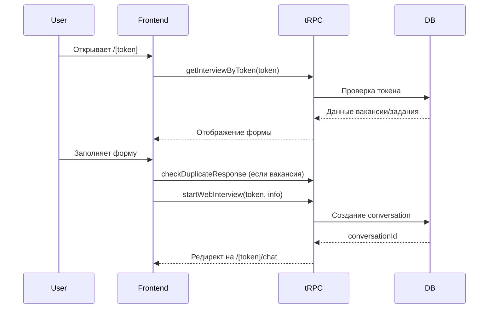
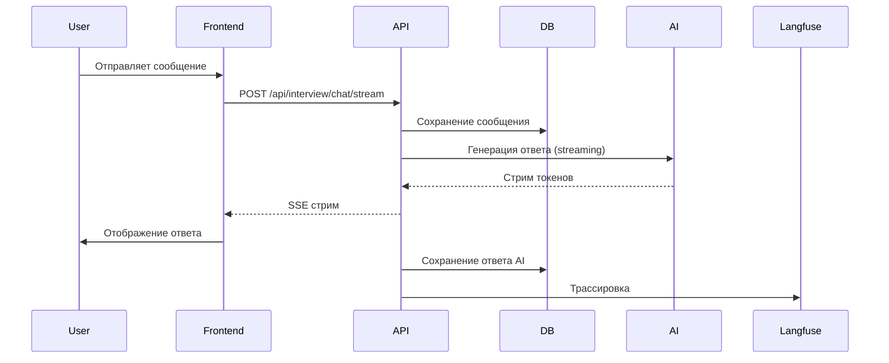
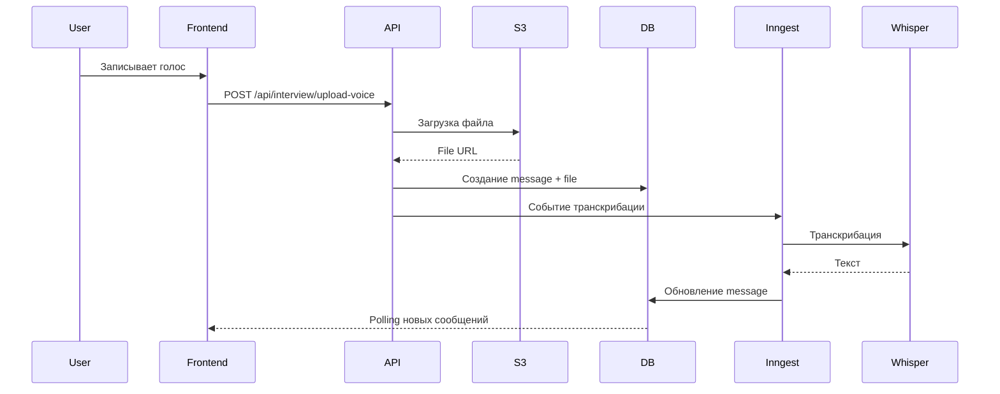

# Interview Service Architecture

Документация по архитектуре отдельного сервиса для AI-интервью.

## Обзор

Interview Service — это отдельное Next.js приложение для прохождения AI-интервью с чистым URL (`domain.ru/[token]`). Сервис изолирован от основного приложения для лучшей производительности, безопасности и масштабируемости.

## Архитектурные решения

### 1. Отдельный Next.js App

**Почему:**
- Чистый URL без префикса `/interview`
- Независимое развертывание и масштабирование
- Минимальный бандл (только компоненты интервью)
- Изоляция публичного доступа от основного приложения

**Структура:**
```
apps/interview/
├── src/
│   ├── app/              # Next.js App Router
│   ├── components/       # Interview-specific components
│   ├── hooks/            # Custom hooks
│   ├── trpc/             # tRPC client/server
│   └── types/            # TypeScript types
└── package.json
```

### 2. Shared UI Package

**Почему:**
- Переиспользование компонентов между сервисами
- Единая точка обновления UI
- Изоляция бизнес-логики форм

**Структура:**
```
packages/interview-ui/
├── src/
│   ├── interview-landing-form.tsx
│   └── index.ts
└── package.json
```

### 3. Публичный доступ без авторизации

**Безопасность:**
- Защита через одноразовые токены
- Валидация токенов на сервере
- Rate limiting на API endpoints
- CORS настройки для разных доменов

## Компоненты системы

### Frontend (Next.js)

#### Страницы

1. **`/[token]`** - Лендинг интервью
   - Загрузка данных вакансии/задания
   - Форма сбора информации о кандидате
   - Валидация и проверка дубликатов

2. **`/[token]/chat`** - Чат интервью
   - AI-ассистент с стримингом ответов
   - Поддержка текстовых и голосовых сообщений
   - Отображение контекста вакансии/задания

#### Компоненты

- `InterviewLandingForm` - Форма начала интервью
- `InterviewChat` - Чат с AI
- `InterviewContextCard` - Карточка контекста
- `AIChatInput` - Инпут с поддержкой голоса

### Backend (API Routes)

#### tRPC Endpoints

```typescript
// Публичные endpoints (без авторизации)
freelancePlatforms.getInterviewByToken({ token })
freelancePlatforms.startWebInterview({ token, freelancerInfo })
freelancePlatforms.getChatHistory({ conversationId })
freelancePlatforms.getInterviewContext({ conversationId })
freelancePlatforms.checkDuplicateResponse({ vacancyId, platformProfileUrl })
```

#### REST Endpoints

```typescript
// POST /api/interview/chat/stream
// Стриминг AI ответов через Server-Sent Events
// Использует Vercel AI SDK + Langfuse для трассировки

// POST /api/interview/upload-voice
// Загрузка голосовых сообщений в S3
// Отправка на транскрибацию через Inngest
```

## Data Flow

### 1. Начало интервью



### 2. Чат с AI



### 3. Голосовые сообщения



## Технологический стек

### Frontend
- **Next.js 16** - App Router, Server Components
- **React 19** - UI библиотека
- **TanStack Query** - Управление состоянием
- **tRPC** - Type-safe API
- **Vercel AI SDK** - AI стриминг
- **Motion** - Анимации
- **Tailwind CSS 4** - Стили

### Backend
- **tRPC** - API layer
- **Drizzle ORM** - Database
- **PostgreSQL** - База данных
- **Inngest** - Background jobs
- **OpenAI/DeepSeek** - AI модели
- **Langfuse** - AI observability
- **AWS S3** - File storage

## Deployment

### Vercel (Production)

```yaml
# vercel.json для apps/interview
{
  "buildCommand": "bun run build",
  "outputDirectory": ".next",
  "framework": "nextjs",
  "regions": ["fra1"],
  "env": {
    "NEXT_PUBLIC_APP_URL": "https://interview.domain.ru"
  }
}
```

### Docker

```bash
# Build
docker build -f apps/interview/Dockerfile -t interview-service .

# Run
docker run -p 3001:3001 \
  -e POSTGRES_URL=... \
  -e OPENAI_API_KEY=... \
  interview-service
```

## Масштабирование

### Horizontal Scaling

- Stateless архитектура
- Shared database (PostgreSQL)
- Shared file storage (S3)
- Load balancer перед инстансами

### Caching

- React Query cache (30s stale time)
- Next.js ISR для статических страниц
- CDN для статических ассетов

### Performance

- Server Components для начальной загрузки
- Streaming для AI ответов
- Lazy loading компонентов
- Image optimization

## Мониторинг

### Metrics

- **Vercel Analytics** - Web vitals, performance
- **Langfuse** - AI трассировка, токены, latency
- **Sentry** - Error tracking
- **Logs** - Vercel/Docker logs

### Alerts

- High error rate (>5%)
- Slow API responses (>2s)
- AI failures
- Database connection issues

## Security

### Authentication

- Токены с ограниченным сроком действия
- Одноразовые токены (single-use)
- Валидация на сервере

### Rate Limiting

```typescript
// Vercel Edge Config
{
  "rateLimit": {
    "requests": 100,
    "window": "1m"
  }
}
```

### Data Protection

- HTTPS only
- Secure headers (CSP, HSTS)
- Input validation (Zod)
- SQL injection protection (Drizzle)
- XSS protection (React)

## Maintenance

### Updates

```bash
# Update dependencies
bun update

# Update specific package
bun update @qbs-autonaim/interview-ui

# Check for outdated
bun outdated
```

### Database Migrations

```bash
# Generate migration
bun run db:generate

# Apply migration
bun run db:push
```

### Rollback

1. Revert deployment в Vercel
2. Restore database backup
3. Clear CDN cache

## Future Improvements

1. **WebSocket** для real-time чата (вместо polling)
2. **Edge Runtime** для faster cold starts
3. **Redis** для session management
4. **GraphQL** вместо tRPC (если нужна публичная API)
5. **Multi-language** support
6. **A/B testing** для UI оптимизации
